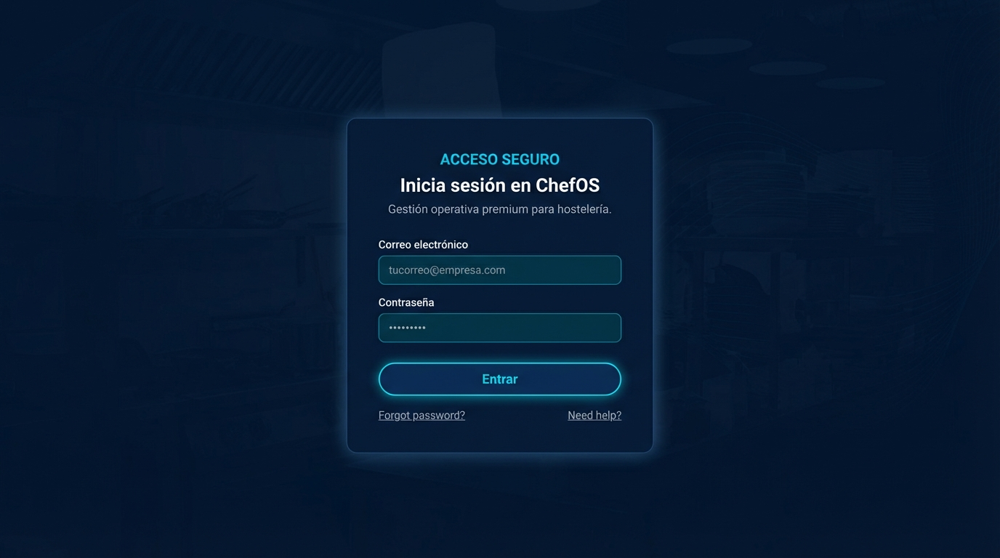
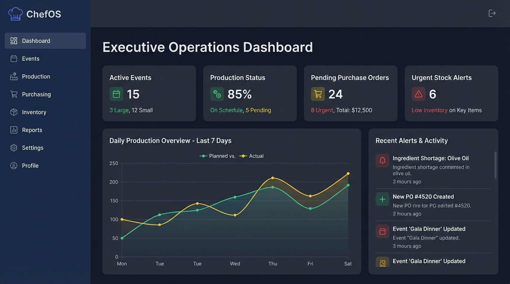
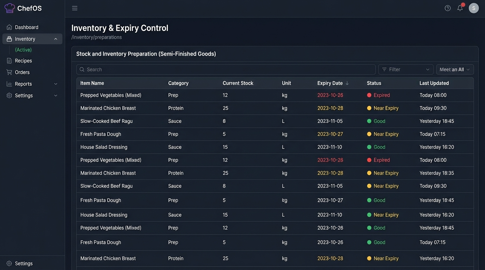
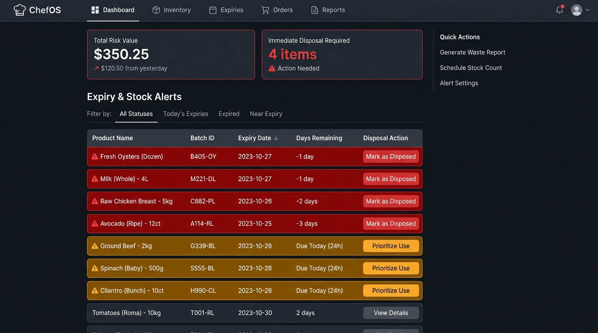
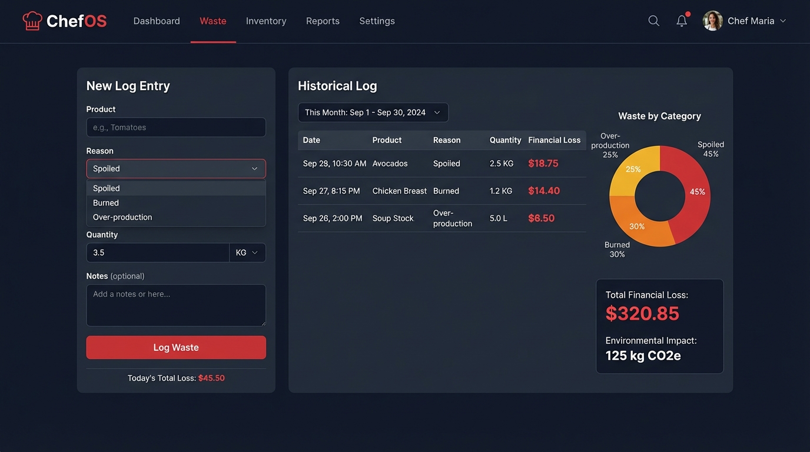
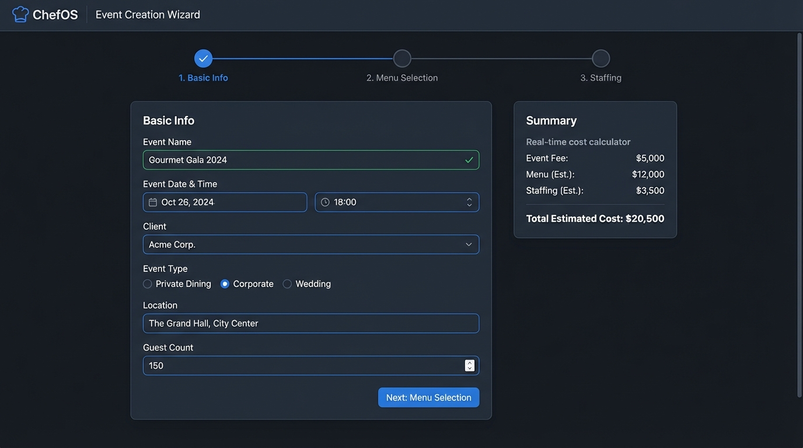
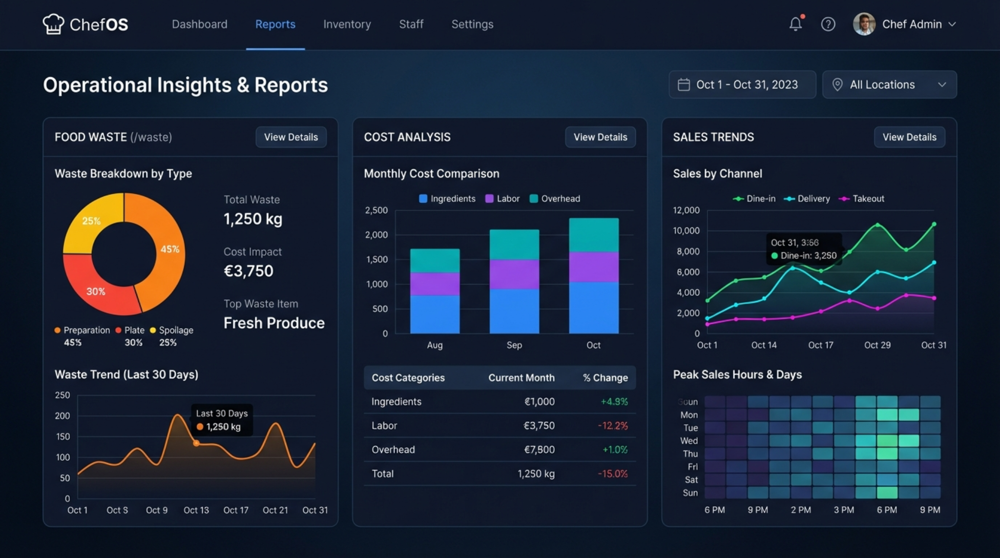
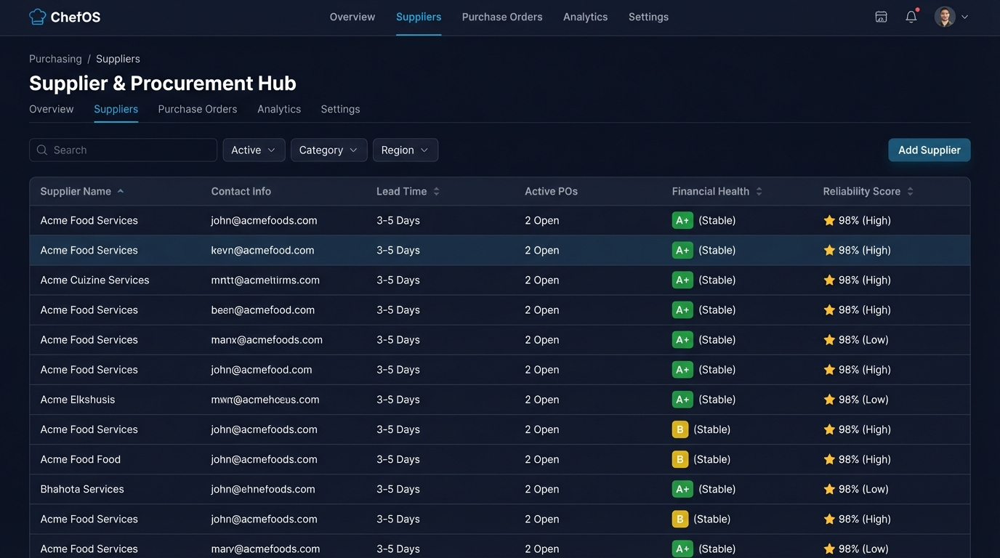

# ChefOS UI Redesign (North Star)

Objetivo: redisenar toda la UI de ChefOS para que coincida **exactamente** con el estilo "premium dark glass" de las pantallas de referencia (login, dashboard, waste, alerts, event wizard, kitchen workflow, suppliers, scheduling, reports, inventory).

Principio operativo:
- No se reescribe la logica de negocio salvo que sea necesario para soportar UI/UX.
- Se prioriza consistencia visual, densidad usable y performance (tablas y grids densos).

Entregables:
1) Tokens de diseno (Tailwind + CSS variables)
2) Libreria de componentes base (cards, tables, badges, inputs, modals, charts)
3) Especificacion de paginas
4) Roadmap por sprints
5) Prompts para Codex (VS Code)
6) Checklist de QA visual

Estado base (Fundación listos):
- Tokens consolidados en `src/styles/theme.css` + Tailwind (colores, radios, sombras, spacing, densidad, kitchen mode).
- AppShell unificado con topbar + sidebar, search, selector de sucursal, notificaciones, toggles de kitchen/densidad y Command Palette (Ctrl/Cmd+K).
- Componentes base disponibles en `src/modules/shared/ui`: Card, Button, Badge, FormField/Input, Select, Table, PageHeader, Modal, Drawer, Skeleton/Banner/DataState.
- KitchenMode aplicado via `body.kitchen`; densidad guardada en `data-density` y localStorage.

Reglas anti-desvio (obligatorias):
- Antes de tocar una pantalla, abre `/docs/ui-redesign/reference/INDEX.md`, la imagen PNG correspondiente y `src/router.tsx` para confirmar la ruta real (ver `CODEX_CONTEXT.md`). No renombres ni crees paginas nuevas.
- Usa solo tokens de `src/styles/theme.css` + Tailwind; sin hex sueltos ni estilos inline (salvo widths/progress puntuales).
- Si falta una libreria (charts), deja placeholder estilado y TODO sin mover rutas.
- Compara visualmente con la referencia antes de cerrar: glass, densidad, badges, headers sticky, topbar/sidebar/toggles funcionando.

## Referencias visuales (source of truth)

Estas capturas son la referencia exacta del redisen. No se inventa un estilo nuevo.

- Login  
  

- Executive Dashboard  
  

- Events Management  
  

- Inventory & Expiry Control  
  

- Expiry & Stock Alerts  
  

- Kitchen Waste Management  
  

- Event Creation Wizard  
  

- Kitchen Production Workflow  
  

- Reports (Operational Insights)  
  

- Suppliers Hub  
  

- Staff Scheduling  
  

- Purchase Order Detail  
  
