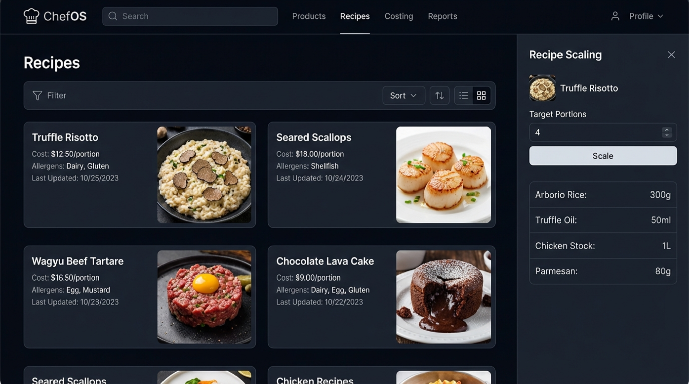

# ChefOS — UI Style Bible (Visual Reference Index)

Este documento es la **fuente de verdad visual** para todo el rediseño de ChefOS.

📌 **Regla absoluta**
- Ningún componente, página o layout debe desviarse de estas referencias.
- Si hay conflicto entre código existente y estas imágenes → **las imágenes ganan**.
- ChatGPT Codex debe abrir la imagen correspondiente antes de modificar cualquier UI.

---

## 1. Login / Acceso Seguro

**Uso:** Autenticación, entrada al sistema  
**Claves visuales:**
- Panel central con glassmorphism
- Glow suave en CTA principal
- Tipografía clara, jerarquía fuerte
- Fondo oscuro con blur ambiental

---

## 2. Executive Operations Dashboard

**Uso:** Vista ejecutiva / gerencia  
**Claves visuales:**
- KPI cards con iconos y subtítulos
- Gráfico principal centrado
- Panel lateral de actividad
- Espaciado generoso, densidad controlada

---

## 3. Events Management Overview

**Uso:** Gestión de eventos  
**Claves visuales:**
- Tabla densa pero legible
- Filtros superiores integrados
- Estados claros (Confirmed, Draft, Completed)
- CTA “New Event” destacado

---

## 4. Kitchen Production Planner

**Uso:** Producción diaria (overview)  
**Claves visuales:**
- KPIs operativos arriba
- Progreso visual
- Agrupación por estación / tiempo
- Botones “Mark as Done” claros

---

## 5. Kitchen Production Workflow (Kanban)

**Uso:** Operación en tiempo real (Modo Cocina)  
**Claves visuales:**
- Sidebar de categorías
- Kanban 3 columnas
- Task cards con:
  - Estación
  - Tiempo estimado
  - Progress bar
  - Badge (critical / on track)
- Toggle “Kitchen Mode” visible

---

## 6. Inventory & Expiry Control

**Uso:** Inventario operativo  
**Claves visuales:**
- Tabla densa
- Estados con chips (Expired / Near Expiry / Good)
- Colores semánticos
- Filtros + búsqueda

---

## 7. Expiry & Stock Alerts

**Uso:** Gestión de riesgo inmediato  
**Claves visuales:**
- KPI de riesgo financiero arriba
- Filas rojas / ámbar dominantes
- CTAs contextuales:
  - Mark as Disposed
  - Prioritize Use
- Quick Actions panel

---

## 8. Kitchen Waste Management

**Uso:** Registro y análisis de merma  
**Claves visuales:**
- Layout en 3 columnas:
  - Formulario
  - Histórico
  - Analytics
- Donut chart por categoría
- Impacto financiero y ambiental visibles

---

## 9. Event Creation Wizard

**Uso:** Creación guiada de eventos  
**Claves visuales:**
- Stepper superior (3 pasos)
- Formulario limpio
- Summary card a la derecha
- Costos en tiempo real

---

## 10. Recipe & Product Catalog

**Uso:** Gestión de recetas  
**Claves visuales:**
- Cards visuales con imagen
- Coste por porción visible
- Panel lateral de scaling
- Densidad equilibrada

---

## 11. Supplier & Procurement Hub

**Uso:** Compras y proveedores  
**Claves visuales:**
- Header con tabs
- Filtros avanzados
- Tabla densa
- Badges de salud financiera y confiabilidad

---

## 12. Staff Scheduling Grid

**Uso:** Planificación de personal  
**Claves visuales:**
- Grid semanal
- Bloques por rol/turno
- Alertas visibles:
  - Understaffed
  - Overtime
- Alta densidad + legibilidad

---

## 13. Operational Insights & Reports

**Uso:** Inteligencia operativa  
**Claves visuales:**
- Donut (waste)
- Stacked bars (costs)
- Line chart (sales)
- Heatmap (peak hours)
- Selector de fechas y sucursal

---

## 14. Purchase Order Detail

**Uso:** Flujo de aprobación de compras  
**Claves visuales:**
- Header con estado (Awaiting Approval)
- Tabla de ítems clara
- Totales bien separados
- Approval workflow + comentarios

---

# Reglas finales (OBLIGATORIAS)

1. **No inventar estilos nuevos**
2. **No cambiar layout sin referencia visual**
3. **Usar siempre tokens de diseño**
4. **Comparar visualmente antes de dar por terminado un cambio**
5. **Si dudas → vuelve a este archivo**

Este documento es el **contrato visual** de ChefOS.
